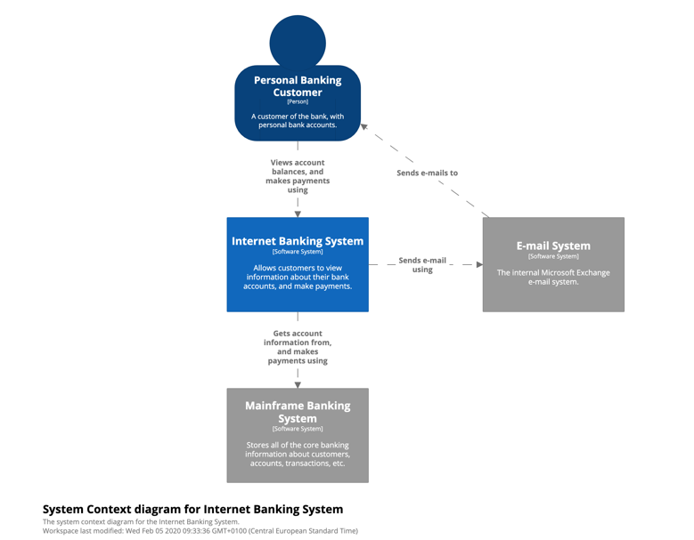
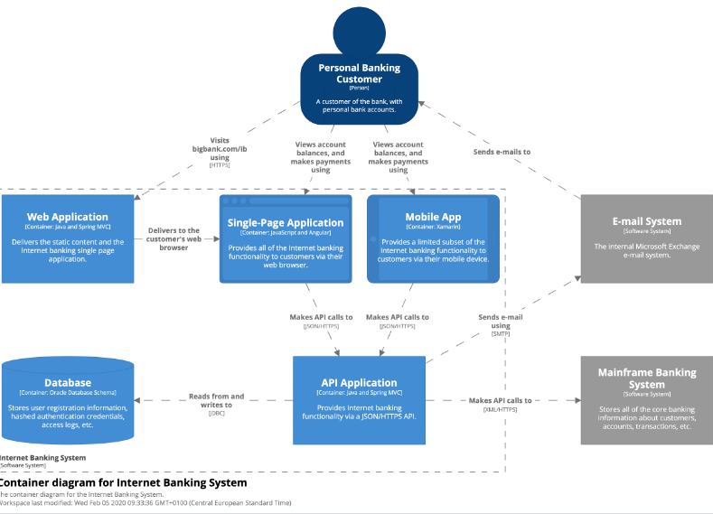
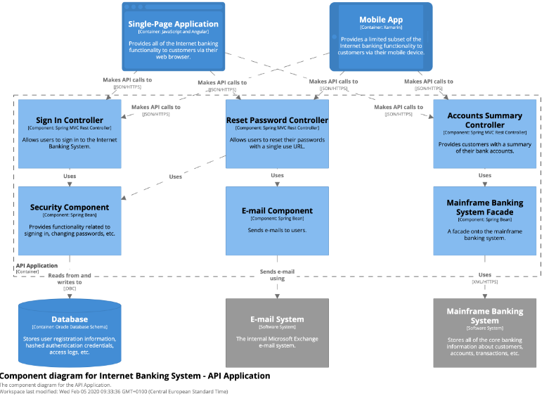
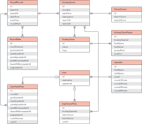

# 3 Modelagem e diagramas arquiteturais: (Modelo C4)
Descrevam brevemente a modelagem da solução apresentando seu diagrama geral com as camadas da arquitetura projetada de forma simples e direta.

Exemplo:

    
  Figura 1: Visão Geral da Solução (camadas)

## 3.1 Nível 1: Diagrama de Contexto
Apresente um diagrama mostrando seu sistema como uma caixa no centro cercada por seus usuários e outros sistemas com os quais ele interage. Demonstre uma visão geral da paisagem do sistema. O foco deve estar nas pessoas (atores, papéis, personas, etc.) e sistemas de software, em vez de tecnologias, protocolos e outros detalhes de baixo nível, conforme figura 2. 

Obs: Este é o tipo de diagrama que se pode mostrar para pessoas não técnicas.

   
  Figura 2: Diagrama de Contexto  (fonte: https://c4model.com/)

Escreva aqui uma breve explicação sobre o diagrama da Figura 2.

## 3.2 Nível 2: Diagrama de Contêiner
Apresente a forma de alto nível da arquitetura de software e como as responsabilidades são distribuídas por ela. Mostre as principais opções de tecnologia e como os contêineres se comunicam entre si. É um diagrama simples e focado em tecnologia de alto nível que é útil tanto para desenvolvedores de software quanto para equipes de suporte/operações (figura 3).

   
  Figura 3 – Diagrama de Contêiner  (fonte: https://c4model.com/)

Escreva aqui uma breve explicação sobre o diagrama da Figura 3.

## 3.3 Nível 3: Diagrama de Componentes
Apresente a composição do contêiner em vários "componentes". O que são cada um desses componentes, suas responsabilidades e os detalhes de tecnologia/implementação.

O diagrama de componentes da aplicação, indica, os elementos da arquitetura e as interfaces entre eles. Liste os estilos/padrões arquiteturais utilizados e faz uma descrição sucinta dos componentes indicando o papel de cada um deles dentro da arquitetura/estilo/padrão arquitetural. Indique também quais componentes serão reutilizados (navegadores, SGBDs, middlewares, etc), quais componentes serão adquiridos por serem proprietários e quais componentes precisam ser desenvolvidos, conforme figura 4.

   
  Figura 4 – Diagrama de Componentes  (fonte: https://c4model.com/)

Escreva aqui uma breve explicação sobre o diagrama da Figura 4.

## 3.4 Nível 4: Código

Aqui vocês devem apresentar cada componente para mostrar como ele é implementado como código; serve também para explicar a arquitetura. Pode-se utilizar um diagrama de classe UML, um diagrama de Entidade/Relacionamentos (figura 5), tabelas do banco de dados, estrutura de um JSON, estrutura de classes de código, etc. 

Este modelo pode ser essencial caso a arquitetura utilize uma solução de banco de dados – SQL, distribuído ou NoSQL.

    
  Figura 5 – Diagrama de Entidade Relacionamento (ER) - exemplo. (Fonte Prof. Pedro Alves)

Acrescentem uma breve descrição sobre o diagrama apresentado na Figura 5, descrevendo as entidades que compõem o sistema.
